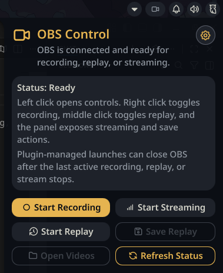
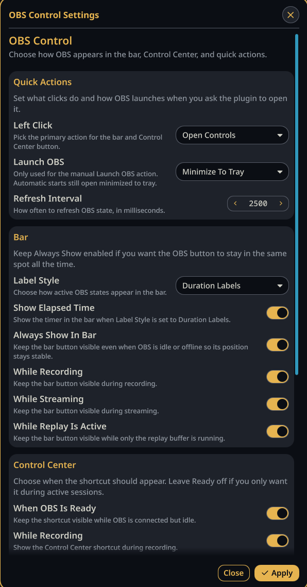

# OBS Control

OBS Studio controls for Noctalia Shell.

OBS Control adds a stable bar button, an optional Control Center shortcut, and a panel for recording, replay buffer, and streaming actions.

## Quick Start

1. Install `obs-studio`.
2. Enable OBS WebSocket in OBS.
3. Install `qt6-websockets` if your Quickshell runtime does not already include Qt WebSockets.
4. Enable the plugin in Noctalia.
5. Add `plugin:obs-control` to your bar or Control Center layout.

On Arch Linux:

```bash
sudo pacman -S obs-studio qt6-websockets
```

## Highlights

- optional always-visible bar button, so the OBS slot stays in the same place
- quick panel actions for record, replay, stream, refresh, videos, and settings
- optional Control Center shortcut
- OBS launch support with minimize-to-tray behavior for automatic starts
- auto-close for plugin-managed OBS launches after the last active output stops
- replay save and open-videos shortcuts
- Noctalia IPC actions for keybinds and scripts

## IPC

General form:

```bash
qs -c noctalia-shell ipc call plugin:obs-control <command>
```

### Commands

| Command | Description |
| --- | --- |
| `togglePanel` | Open or close the OBS panel |
| `openSettings` | Open the plugin settings |
| `toggleRecord` | Start or stop recording |
| `toggleReplay` | Start or stop the replay buffer |
| `toggleStream` | Start or stop streaming |
| `saveReplay` | Save the current replay buffer |
| `launchObs` | Launch OBS |
| `refreshStatus` | Refresh OBS state |
| `openVideos` | Open the configured videos folder |
| `primaryAction` | Run the configured left-click action |
| `secondaryAction` | Run the right-click action |
| `middleAction` | Run the middle-click action |

Example Niri binds:

```kdl
binds {
    Mod+F9 { spawn "qs" "-c" "noctalia-shell" "ipc" "call" "plugin:obs-control" "toggleRecord"; }
    Mod+F10 { spawn "qs" "-c" "noctalia-shell" "ipc" "call" "plugin:obs-control" "toggleReplay"; }
    Mod+Shift+F10 { spawn "qs" "-c" "noctalia-shell" "ipc" "call" "plugin:obs-control" "saveReplay"; }
    Mod+F11 { spawn "qs" "-c" "noctalia-shell" "ipc" "call" "plugin:obs-control" "toggleStream"; }
    Mod+F12 { spawn "qs" "-c" "noctalia-shell" "ipc" "call" "plugin:obs-control" "togglePanel"; }
}
```

## Settings

You can open settings from:

- **Plugins → OBS Control → Configure** in Noctalia
- the **gear button** in the panel header
- IPC with `qs -c noctalia-shell ipc call plugin:obs-control openSettings`

## Troubleshooting

- If OBS is running but control is unavailable, restart OBS once after enabling obs-websocket.
- If the plugin reports missing Qt WebSockets support, install `qt6-websockets` and restart Noctalia.
- If OBS WebSocket is disabled, enable it in OBS and then refresh or restart Noctalia.
- If `xdg-open` opens a terminal file browser, set **Videos Opener** to your GUI file manager.
- If actions do nothing, try:

```bash
qs -c noctalia-shell ipc call plugin:obs-control refreshStatus
```

## Screenshots




